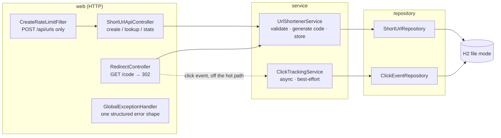
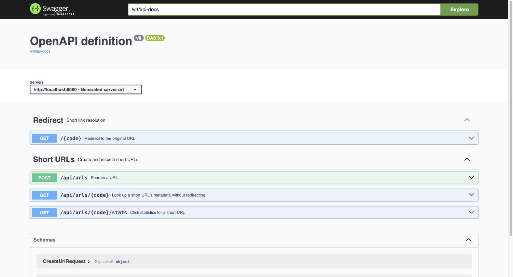
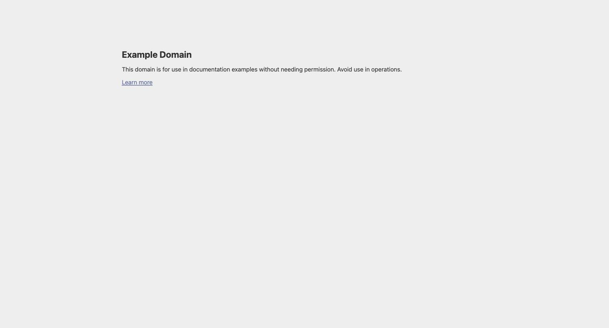
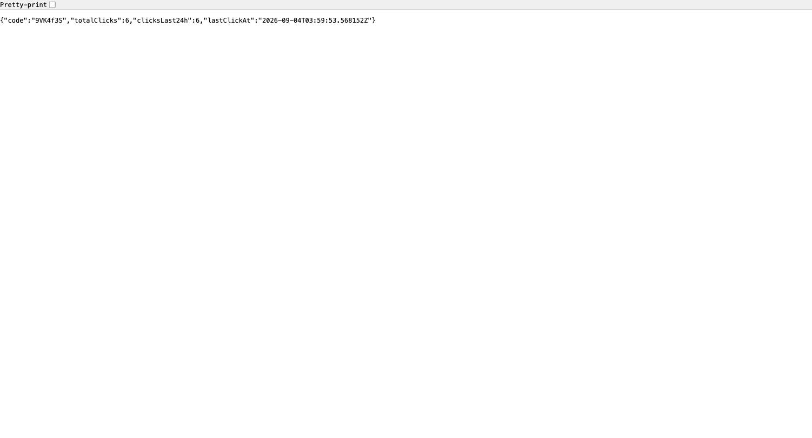
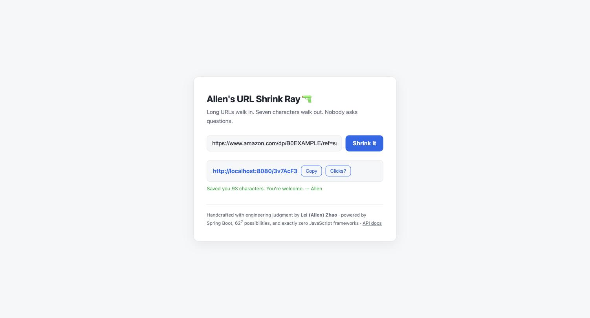
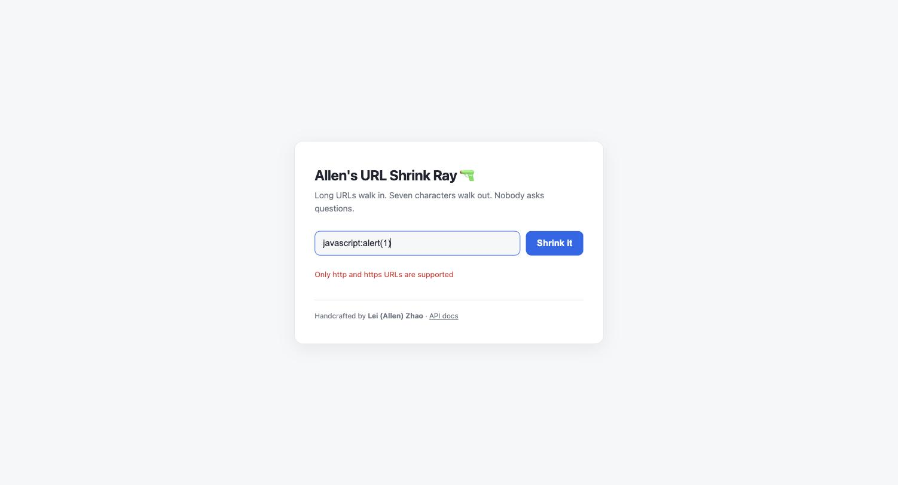
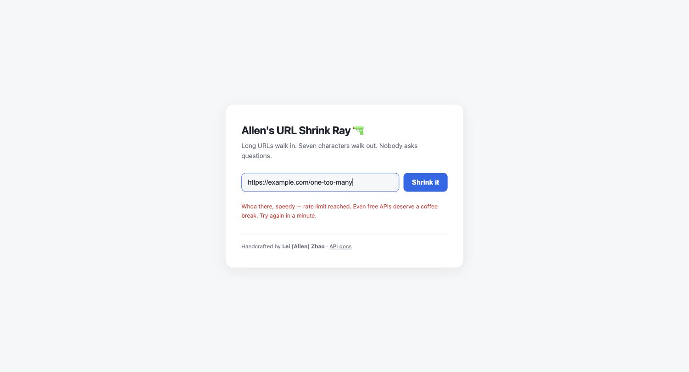

# URL Shortener — AI-Assisted Engineering Assignment

A URL shortener service built as a demonstration of **engineer-led, AI-accelerated
delivery**: requirement analysis, task decomposition, disciplined AI usage with full
traceability, and validation at every step.

> Status: **Complete (Parts 1–3)** — greenfield core, click analytics (brownfield
> scenario), reliability features (ambiguous scenario), hardening, risk register, and final
> summary. Task board: `docs/decomposition.md` (T1–T19, all done). Start with
> `docs/final-summary.md` for the full picture.

## Stack

Java 21 · Spring Boot 3.5 · Maven · H2 (file mode) · springdoc-openapi

## How it works

A URL shortener is a lookup table plus a redirect service — the long URL is never
"compressed"; it is stored, and a random key points at it:

1. **Shorten** — `POST /api/urls` with a long URL. The service validates it (absolute
   `http`/`https`, host present, ≤ 2048 chars — dangerous schemes like `javascript:` are
   rejected), generates a random 7-char Base62 code (`0-9A-Za-z`, ~3.5 × 10¹² combinations,
   unrelated to the URL's content), and persists the code → URL mapping. If the random code
   collides with an existing one, the DB unique constraint rejects it and a fresh code is
   tried (up to 5×). Response: `201` with the short URL.
2. **Redirect** — `GET /{code}` looks the code up and answers `302` with the original URL
   in `Location`; the browser follows it. Unknown code → `404`. Each successful redirect
   also records a click event asynchronously — never on the redirect's critical path.
3. **Inspect** — `GET /api/urls/{code}` returns the mapping's metadata,
   `GET /api/urls/{code}/stats` the click statistics.

Submitting the same URL twice deliberately yields two different codes (no deduplication) —
a documented product choice (ADR-002): same-code-for-same-URL would let outsiders probe
whether a URL was already shortened, and independent shares deserve independent stats.

## Architecture

Layered Spring Boot service; every dependency points inward (web → service → repository),
and storage sits behind repository interfaces so the engine can be swapped.



**Control flow, hot path (redirect):** route-constrained code (`[0-9A-Za-z]{1,16}`) →
`resolve` (one indexed lookup) → 302 with `Location`. Click capture is handed to a bounded
async executor and never blocks or fails the redirect (ADR-005).

**Control flow, write path:** rate-limit filter (per-IP fixed window) → bean validation →
`UrlValidator` (security boundary, ADR-004) → generate random code → insert; a unique-key
collision is caught and retried up to 5× — the DB constraint is the source of truth, no
check-then-insert race (ADR-002).

**Cross-cutting:** all error paths converge on `GlobalExceptionHandler` for one structured
error shape; storage failures degrade to 503; health (incl. DB) exposed via actuator.

### Project layout

```
src/main/java/com/example/urlshortener/
├── web/          controllers, rate-limit filter, exception handler, DTOs
├── service/      domain logic, validation, code generation, click tracking, config
├── repository/   Spring Data JPA interfaces
├── model/        ShortUrl, ClickEvent entities
└── exception/    domain exceptions
docs/             requirements, decomposition, ADRs, AI log, scenarios, risks, evidence
```

## Quick start

Prerequisites: JDK 21+ (Maven not required — the included wrapper fetches it).

```bash
./mvnw spring-boot:run      # Windows: mvnw.cmd spring-boot:run
```

The service listens on `http://localhost:8080`. Open `http://localhost:8080/` for the
demo page (paste a URL, get a short link), or `http://localhost:8080/swagger-ui.html`
for interactive API docs.

### Try it

```bash
# Shorten a URL
curl -s -X POST http://localhost:8080/api/urls \
  -H 'Content-Type: application/json' \
  -d '{"url":"https://www.example.com/some/very/long/path?with=params"}'
# → {"code":"Ab3xY9z","shortUrl":"http://localhost:8080/Ab3xY9z", ...}

# Follow the short link (302)
curl -i http://localhost:8080/Ab3xY9z

# Inspect metadata without redirecting
curl -s http://localhost:8080/api/urls/Ab3xY9z
```

## API

| Method | Path | Description | Responses |
|--------|------|-------------|-----------|
| POST | `/api/urls` | Shorten a URL (`{"url": "https://..."}`) | 201 created; 400 invalid/blank/oversized URL or disallowed scheme |
| GET | `/{code}` | Redirect to the original URL | 302 with `Location`; 404 unknown code |
| GET | `/api/urls/{code}` | Mapping metadata (no redirect) | 200; 404 |
| GET | `/api/urls/{code}/stats` | Click statistics (total, last 24 h, last click) | 200; 404 |
| GET | `/actuator/health` | Health incl. DB, liveness/readiness groups | 200 |

`POST /api/urls` is rate-limited per client IP (default 20/min, configurable via
`app.rate-limit.create-per-minute`); over-limit requests get `429` + `Retry-After`.
Redirects and reads are never rate-limited.

Errors return a structured body: `{"status", "error", "message", "timestamp"}`.

## Tests

```bash
./mvnw test     # unit + integration suite
./mvnw verify   # tests + Spotless format check (same gate CI runs)
```

- **Unit**: validation policy (schemes, host, length), collision retry and exhaustion,
  short-URL construction; click capture (truncation, null metadata, failure swallowing),
  stats aggregation.
- **Integration** (MockMvc + in-memory H2): full HTTP contract — 201/400/302/404,
  cross-request code uniqueness; async click capture reflected in stats; rate limiting
  (429 + `Retry-After`, reads unaffected) in an isolated low-limit context; health probe.

Run logs are retained under `docs/evidence/`.

**Approach:** unit tests pin the domain rules; integration tests pin the HTTP contract
end-to-end against a real (in-memory) database — mocks appear only where reality can't be
provoked on demand (storage outage). Every part additionally shipped with a live curl
transcript, and the final build was verified from a clean copy including persistence across
restart (`docs/evidence/part3-clean-run.log`). CI (`.github/workflows/ci.yml`) runs
`mvn -B verify` on every push/PR.

## Screenshots

**Core deliverables in action** — the OpenAPI surface, a short link followed to its
destination in a real browser, and the click statistics behind it:

| OpenAPI docs (`/swagger-ui.html`) | Redirect followed | Click stats |
|---|---|---|
|  |  |  |

**Bonus demo page** (`/`) — a single-file static shell over the same API (not part of the
required scope), which also makes the guardrails visible: a `javascript:` URL rejected by
validation (ADR-004) and the 21st create in a minute hitting the per-IP rate limit (ADR-006):



| Dangerous scheme → 400 | Rate limit → 429 |
|---|---|
|  |  |

More transcripts and per-part run logs live in [`docs/evidence/`](docs/evidence/).

## The three scenarios

Each required scenario has a dedicated write-up showing decomposition → execution →
validation:

1. **[Greenfield](docs/scenarios/greenfield-core.md)** — building the core service from
   zero: requirement normalization, task breakdown (T1–T8), schema and short-code design
   (ADR-002), API contract, and the test suite that pinned it.
2. **[Brownfield](docs/scenarios/brownfield-analytics.md)** — enhancing the existing
   system with click analytics: a written **impact analysis before any code change**
   (affected modules, data flow, failure scenarios, and what stays untouched), then async
   capture + stats endpoint with the Part-1 contract tests passing unmodified.
3. **[Ambiguous requirement](docs/scenarios/ambiguous-reliability.md)** — turning
   "reliability features" into an engineering scope: six candidate interpretations scored
   by value/cost, three implemented (per-IP rate limiting, health probes, graceful 503),
   three deferred with recorded rationale.

## Limitations & trade-offs

Deliberate scope cuts (anonymous API, no link expiry/aliases, H2 as prototype store,
per-instance rate limiting, best-effort analytics) are recorded with rationale and their
production paths in `docs/risks.md`; the condensed version is §5–§7 of
`docs/final-summary.md`.

## Documentation map

| Doc | Content |
|-----|---------|
| `docs/requirements.md` | Requirement interpretation, ambiguities, assumptions |
| `docs/decomposition.md` | Task breakdown with dependencies, sequencing, status |
| `docs/decisions.md` | ADRs: stack, short-code strategy, 302 vs 301, validation policy |
| `docs/ai-log.md` | Per-task AI usage: intent → output → adopted/edited/rejected + rationale |
| `docs/scenarios/` | Three scenarios: greenfield, brownfield (impact analysis), ambiguous (normalization) |
| `docs/risks.md` | Risk register: failure scenarios, guardrails, production paths |
| `docs/final-summary.md` | Final engineering summary: plan, artifacts, validation, trade-offs, limitations |
| `docs/evidence/` | Build & test logs, live API transcripts, clean-environment verification |

## Key design decisions (details in `docs/decisions.md`)

- **Short codes**: random Base62 (length 7, `SecureRandom`) with DB unique constraint as
  the source of truth and bounded collision retry — not enumerable, scales horizontally.
- **302 not 301**: every hit reaches the service, so links stay revocable and analytics
  (Part 2) stay accurate.
- **Validation as a security boundary**: only absolute `http`/`https` URLs with a host,
  ≤ 2048 chars — `javascript:`/`data:`/`file:` schemes are rejected outright.
- **Layered & swappable**: web / service / repository separation; storage behind
  `ShortUrlRepository` so the engine can be swapped (planned brownfield exercise).
- **Best-effort analytics**: per-click events captured async off the redirect thread
  (bounded executor, drop-with-log) — losing a click never loses a redirect (ADR-005).
- **Reliability, scoped deliberately**: health probes, per-IP create rate limiting
  (hand-rolled, no new dependency — ADR-006), storage failures degrade to clean 503s;
  retries/circuit breakers deferred with recorded rationale.
